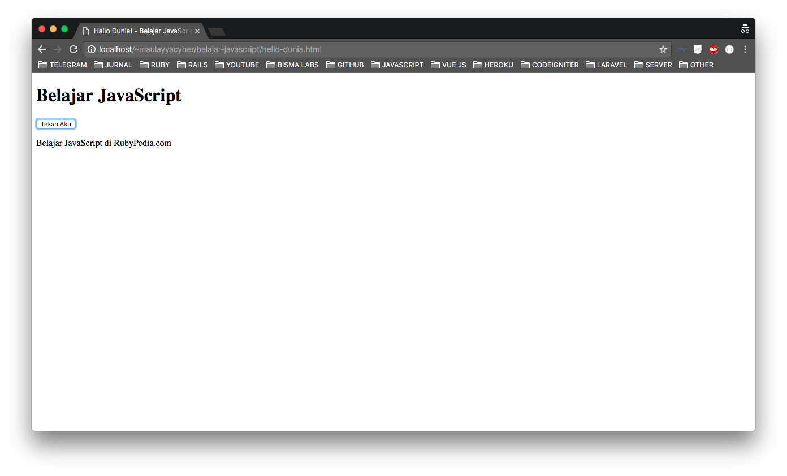

Kalau Anda ingin menjadi seorang web developer yang dapat mendesain maupun melakukan pemrogramman sekaligus, maka JavaScript merupakan bahasa pemrogramman wajib yang harus dikuasai. JavaScript adalah bahasa pemrogramman yang berkembang pesat, yuk kita kenalan dengan javascript.

# Karakteristik JavaScript

Beberapa karakteristik dari JavaScript sebagai berikut:

Bahasa pemrogramman berjenis high-level programming (struktur dab syntaxnya mudah dipahami karena menggunakan bahasa yang mudah dimengerti manusia).

Bersifat client-side (hanya membutuhkan web browser untuk menguji JavaScript)

Berorientasi object (cocok buat Anda yang ingin masuk ke dalam konsep pemrogramman berbasis object).

Bersifat loosely typed (tidak membutuhkan deklarasi variable terlebih dahulu).

# Tool dan Syarat yang Dibutuhkan

Unuk mempelajari dan membuat pemrogramman website menggunakan JavaScript, Anda tidak perlu membutuhkan tool khusus. Minimal Anda membutuhkan 2 tool standart berikut:

Text-Editor : silahkan gunakan Text-Editor seperti Notepad, Notepad ++, Sublime Text, VScode, Atom, dll. sesuiakan dengan selera Anda.

Browser : Anda bisa menggunakan Browser sesuai selera, seperti Mozilla Firefox, Google Chrome, Safari, Internet Explorer, dll.

HTML : Sebelum belajar JavaScript, sebaiknya Anda sudah paham dasar-dasar tentang HTML terlebih dahulu, karena JavaScript ditulis diantara tag-tag HTML.

# Fungsi JavaScript dalam Desain Website

Pemrogramman dasar untuk pembuatan website adalah HTML. Namun HTML hanya bisa menghasilkan dokumen statis dan non interaktif. JavaScript diciptakan untuk mengatasi kelemahan ini.

Apabila Anda ingin membuat situs yang dapat berinteraksi antara user dengan website secara cepat tanpa harus melibatkan web server, maka maka digunakanlah JavaScript.

Tanpa koneksi internet sekalipun, data yang diinput oleh user dapat diproses langsung. Hal ini terjadi karena JavaScript bersifat client-side.

# Kelemahan JavaScript

Dibalik kehandalan dan popularitasnya, JavaScript juga memiliki kelemahan-kelemahan. berikut ini kelemahan yang ada di JavaScript:

Pengaksesan internet dapat mematikan fitur JavaScript pada browser sehingga ada kemungkinan website itu menjadi menjadi tidak berjalan semestinya bagi sisi pengakses.

JavaScript dianggap pemrogramman yang tidak aman karena kodenya pemrogrammanya dapat dilihat dan dimodifikasi oleh pengakses website.

Sangat tergantung pada kapabilitas browser terhadap kode-kode JavaScript. Itu artinya, pemrogramman JavaScript saat ini mungkin tidak di support oleh browser versi lama.

# Mencoba JavaScript Pertama “Hallo Dunia”

Sudahkah siap membuat website dengan JavaScript ?, yuk kita coba langsung

# Buka Text-Editor

Kemudian masukkan dan simpan kode berikut ini dengan extensi .html, contoh hallo.html:

% highlight html linenos %
<!DOCTYPE html> <html> 
<head> <title>Hallo Dunia! - Belajar JavaScript Pertama</title> 

 </head> 
<body> <h1>Belajar JavaScript</h1> <!-- klik fungsi hallo dunia() --> <button id="klik" onclick="halodunia()">Tekan Aku</button> <!-- menampilkan pesan Belajar JavaScript di superjuara --> 

 </body> </html>


Kemudia cara menjalankanya, klik file hallo.html dua kali, maka kurang lebih hasilnya kurang lebih seperti berikut ini:

                 
